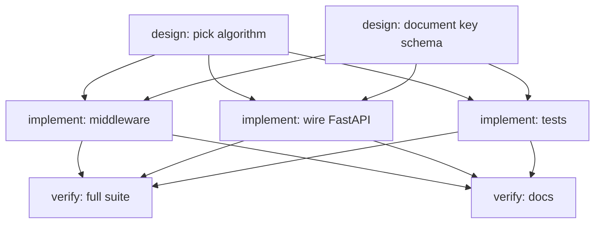

# Plans

**How do I write a plan YAML so Bernstein executes it?**

A plan is a declarative YAML file that describes a goal as a directed graph
of tasks. Stages run sequentially (with explicit `depends_on` overrides),
steps inside a stage run in parallel. Bernstein loads the plan, validates
the graph, materialises each step as a `Task` row, and lets the orchestrator
schedule it. Anything you can do at the CLI by typing
`bernstein run --goal "..."` you can also describe declaratively as a plan
and re-run with `bernstein run --from-plan path/to/plan.yaml` - same
contract, reproducible inputs.

If you only have time for one sentence: **a plan is just YAML with
top-level `name`, `stages[].steps[]`, and optional knobs for budget /
agents / repos**. The rest of this page is the schema, validation flow,
generation, and a worked example.

---

## What a plan is

The runtime model is simple:

- A **plan** has one or more **stages**.
- A **stage** has one or more **steps**.
- A **step** becomes a **task** the orchestrator schedules onto an agent.
- **Stages** run sequentially by default; declare `depends_on` to skip the
  default ordering or to express cross-stage parallelism.
- **Steps within a stage** run in parallel - the loader marks each step in
  stage `B` as `depends_on` every step title in stages `B.depends_on`, so
  no work in `B` starts until all of `A`'s steps are done.

This is the same data model the manager agent emits when planning from a
free-text goal, just expressed by hand.

Source-of-truth files:
`src/bernstein/core/planning/plan_schema.py` (schema),
`src/bernstein/core/planning/plan_loader.py` (YAML → Task list),
`src/bernstein/core/planning/planner.py` (LLM-driven planning).

---

## YAML schema (top-level keys)

| Key | Type | Required | Meaning |
|-----|------|----------|---------|
| `name` | string | yes | Short plan name; appears in logs and is used as the orchestration goal. |
| `stages` | list | yes | Ordered execution stages (≥1). |
| `description` | string | no | Free-text summary of what the plan changes. |
| `cli` | string | no | Adapter to pin every step to (`auto`, `claude`, `codex`, ...). Per-step `cli` overrides this. |
| `budget` | string \| number | no | Spending cap (`"$10"`, `5.00`). Stops the run when exceeded. |
| `max_agents` | integer | no | Override `bernstein.yaml`'s `max_agents` for this plan. |
| `constraints` | list[string] | no | Hard constraints injected into every agent's prompt. |
| `context_files` | list[string] | no | Extra files concatenated into every agent's context. |
| `repos` | list[object] | no | Repo references for multi-repo plans. Each entry is `{path, branch?, name?}`; `path` is required. |

Source: `plan_schema.py:198-244` (`PLAN_JSON_SCHEMA`).

### Stage fields

| Key | Type | Required | Meaning |
|-----|------|----------|---------|
| `name` | string | yes | Unique stage name (used in `depends_on`). |
| `steps` | list | yes | At least one step. |
| `description` | string | no | Human-readable summary. |
| `depends_on` | list[string] | no | Names of upstream stages that must complete first. |
| `repo` | string | no | Route every step in this stage to one repo (multi-repo plans only). |

Source: `plan_schema.py:155-178` (`_STAGE_SCHEMA`).

---

## Step (task) fields

Each step compiles into one `Task` (`bernstein.core.models.Task`) with the
fields below. Either `title` or `goal` is required (the latter is a legacy
alias).

| Key | Type | Default | Meaning |
|-----|------|---------|---------|
| `title` | string | - | Short title. **Required** unless `goal` is set. |
| `goal` | string | - | Legacy alias for `title`. |
| `description` | string | `title` | Detailed instructions injected into the agent prompt. |
| `role` | enum | `backend` | Specialist role; one of `analyst, architect, backend, ci-fixer, data, devops, docs, frontend, manager, ml-engineer, prompt-engineer, qa, resolver, retrieval, reviewer, security, visionary, vp` (`plan_schema.py:20-39`). |
| `priority` | int 1-5 | `2` | 1 = highest, 5 = lowest. Affects orchestrator ordering when multiple steps are ready. |
| `scope` | enum | `medium` | `small` (<30min), `medium` (30-90min), `large` (90min+). Influences cost/model picks. |
| `complexity` | enum | `medium` | `low`, `medium`, `high`. Drives router/cascade tier choice. |
| `model` | enum | - | Override model: `auto`, `opus`, `sonnet`, `haiku`. |
| `effort` | enum | - | Effort knob: `low`, `normal`, `high`, `max`. |
| `estimated_minutes` | int | `30` | Used by the duration predictor and plan cost estimate. |
| `mode` | string | - | Execution mode (e.g. `batch`). |
| `cli` | string | - | Override adapter for this step only. |
| `repo` | string | - | Multi-repo: route this step to a named repo. Falls back to stage-level `repo`. |
| `depends_on_repo` | string | - | Cross-repo dependency: another repo must complete first. |
| `files` | list[string] | `[]` | File ownership for conflict detection - agents declare which files they will touch. |
| `completion_signals` | list[object] | `[]` | Machine-checkable completion criteria (see below). |

Step-level `depends_on` is *not* on the schema - dependencies between
steps are declared at the **stage** level. The loader expands stage
dependencies into per-step `depends_on` lists when it builds the Task
objects (`plan_loader.py:244-249`).

Source: `plan_schema.py:79-153` (`_STEP_SCHEMA`).

### Completion signals

A step can declare zero or more signals the janitor uses to decide
whether the agent finished. Each signal is `{type, ...}` where the extra
keys depend on `type`:

| Type | Extra keys | Meaning |
|------|-----------|---------|
| `path_exists` | `path` | The given path must exist after the run. |
| `glob_exists` | `value` (glob) | Any path matching the glob must exist. |
| `test_passes` | `command` | Shell command must exit 0. |
| `file_contains` | `path`, `contains` | File must exist and include the substring. |
| `llm_review` | `value` (criteria) | LLM judge applies the given criteria. |
| `llm_judge` | `value` | Free-form LLM judgement. |

Source: `plan_schema.py:49-77`, `plan_loader.py:70-97`.

---

## Plan validation: `bernstein validate`

`bernstein validate path/to/plan.yaml` runs four checks before the plan is
ever scheduled:

1. **Schema check** - required fields, enum values, integer ranges
   (`plan_schema.validate_plan()` at `plan_schema.py:428-451`).
2. **Duplicate titles** - every step title must be unique within the plan
   (`plan_validate_cmd._check_duplicate_titles`).
3. **Dependency references** - every `depends_on` entry must point at a
   real upstream stage name (`_check_dependency_refs`).
4. **Cycle detection** - DFS over the stage DAG; reports any cycle
   (`_check_dependency_cycles`).

Plus warnings:

- **Unknown roles** - any role not in the registry-known list is flagged
  (`_check_unknown_roles`).

Common errors:

| Error | Fix |
|-------|-----|
| `Missing required top-level field 'stages'` | Add a `stages:` list at the root. |
| `stages[2]: missing required field 'name'` | Every stage must have a unique `name:`. |
| `stages[2].steps: must contain at least one step` | Empty stages aren't allowed. |
| `stages[2].steps[0]: step must have a 'title' or 'goal' field` | Add `title:` (preferred) or `goal:`. |
| `stages[2].steps[0].role: invalid value 'devsecops'` | Use one of the 18 known roles. |
| `Plan file must be a YAML mapping` | Top-level must be a dict, not a list. |
| `Cycle detected: a -> b -> a` | Break the dependency chain. |

Run validation in CI before merging plan files - schema drift and missing
deps are the two failure modes that bite hardest.

Source: `cli/commands/plan_validate_cmd.py:142-163`.

---

## Plan generation: `bernstein plan generate`

Hand-writing YAML is fine; for greenfield work let the LLM scaffold one:

```bash
bernstein plan generate "Add Redis-backed rate limiting to all API endpoints"

# Custom model / provider:
bernstein plan generate "Migrate auth from JWT to Paseto" \
  --model anthropic/claude-haiku-4-5 --provider openrouter

# Preview without writing:
bernstein plan generate "Add OpenTelemetry tracing" --dry-run

# Pin output path:
bernstein plan generate "Bump dependencies" -o plans/deps.yaml
```

What the command does (`cli/commands/plan_generate_cmd.py:268-340`):

1. **Gather repo context** - directory tree, `README.md`, top-level
   files, build config (capped at ~8 KB).
2. **Build prompt** - concatenates description + repo context + a system
   prompt asking for `name / description / stages / steps` YAML.
3. **Call LLM** - Haiku 4.5 by default (cheap; you usually iterate on the
   plan in your editor anyway). 2k token cap, temperature 0.3.
4. **Extract YAML** - strips markdown fences if the model wraps the answer.
5. **Inject defaults** - fills `name`/`description` from the user's input
   if the model omitted them.
6. **Estimate cost** - sums step complexities into a rough USD figure.
7. **Save** - to `plans/<slug>.yaml` (or `--output`); `--dry-run` prints
   to stdout.

The output is **never** auto-executed. You're expected to read it, edit
roles/scopes, and run `bernstein validate` before `bernstein run
--from-plan`.

There is also a higher-tier API in
`core/planning/plan_execute.py` (`build_plan`, `save_plan`) which the
manager agent uses internally - it picks the most capable available
planning model (Opus / o3) and produces `GeneratedPlan` objects with
per-task `recommended_model` selections (`plan_execute.py:120-203`).

---

## Plan loading and execution

When you run `bernstein run --from-plan path.yaml` (or pass it via API),
the loader does the following:

1. **Parse YAML** (`plan_loader.load_plan()` at `plan_loader.py:120-196`).
2. **Build a `PlanConfig`** - top-level metadata (name, description,
   constraints, repos, budget, max_agents, cli).
3. **Walk stages** - for each stage build an in-order list of step titles.
4. **Materialise tasks** - each step becomes a `Task` with:
   - `id = "plan-<stage_idx>-<step_idx>"` (replaced server-side once
     posted to `/tasks`).
   - `depends_on` populated from the upstream stages' step titles
     (cross-stage dep expansion at `plan_loader.py:244-249`).
   - `owned_files` from the step's `files` list - used by the conflict
     detector so two parallel agents can't clobber each other.
   - `completion_signals` parsed and validated (invalid entries are
     logged and dropped, not fatal).
5. **Resolve title→ID** - once all tasks have server-assigned IDs, the
   manager parser's `_resolve_depends_on` rewrites titles to UUIDs so the
   orchestrator can join.
6. **Post to `/tasks`** - each task is `POST`ed to the running Bernstein
   server (one HTTP call per step, with a 10 s timeout).

From here the run looks identical to a free-text goal: the orchestrator
ticks, the spawner picks up `OPEN` tasks whose `depends_on` are all
`DONE`, and the janitor verifies completion signals.

Repeat-runs: if you re-run the same plan, dedupe is **by title**, not by
plan-task-ID - the server's task store treats incoming tasks as new
unless your plan changes the title. For idempotent re-runs prefer
`bernstein replay` over re-posting.

---

## Workflow DSL (extended plans)

For DAGs with **conditional edges** and **retry loops**, Bernstein has a
sibling format in `core/planning/workflow_dsl.py`. It's a stricter
successor that adds:

- **Phases** - explicit gates (`plan`, `implement`, `verify`, `merge`)
  with `requires_approval` and `allowed_roles`.
- **Conditional edges** - `depends_on: [{source: x, condition: "status
  == 'failed'"}]` - the edge resolves only when the upstream task's
  output matches the predicate.
- **Retry loops** - `retry: {max_attempts: 3, until: "status == 'done'"}`.
- **Safe expression evaluator** - no `eval()`; AST is whitelisted to
  comparisons, boolean ops, attribute / subscript access, and literals
  (`workflow_dsl.py:108-228`).

Workflow DSL files live under `.bernstein/workflows/` and load by name
(`load_workflow_dsl(name)` at `workflow_dsl.py:1013-1038`).

Example (cribbed from the module docstring):

```yaml
name: ci-pipeline
version: "1.0.0"

phases:
  - name: plan
    allowed_roles: [manager, architect]
  - name: implement
    requires_approval: true
  - name: verify
    allowed_roles: [qa, security]
  - name: merge
    allowed_roles: [manager]

nodes:
  decompose:
    phase: plan
    role: manager

  build-api:
    phase: implement
    role: backend
    depends_on: [decompose]

  run-tests:
    phase: verify
    role: qa
    depends_on: [build-api]

  fix-bugs:
    phase: implement
    role: backend
    depends_on:
      - source: run-tests
        condition: "status == 'failed'"
    retry:
      max_attempts: 3
      until: "status == 'done'"

  deploy:
    phase: merge
    role: manager
    depends_on:
      - source: run-tests
        condition: "status == 'done'"
```

Use the plain plan format for linear or sequential-stage work; reach for
the workflow DSL only when you need conditional edges or retry loops.

---

## Working example: small backend feature

A minimal plan with three stages and a dependency override:

```yaml
name: rate-limit-api
description: Add Redis-backed rate limiting to the public API.

budget: "$5"
max_agents: 4
constraints:
  - All HTTP calls must declare an explicit timeout.

stages:
  - name: design
    description: Decide the algorithm and storage.
    steps:
      - title: "Pick rate-limit algorithm (token bucket vs sliding window)"
        role: architect
        complexity: medium
        scope: small

      - title: "Document Redis key schema"
        role: docs
        scope: small

  - name: implement
    description: Build the middleware + tests.
    depends_on: [design]
    steps:
      - title: "Add RateLimiter middleware"
        role: backend
        complexity: high
        scope: medium
        files:
          - src/api/middleware/rate_limiter.py
        completion_signals:
          - type: file_contains
            path: src/api/middleware/rate_limiter.py
            contains: "class RateLimiter"

      - title: "Wire middleware into FastAPI app"
        role: backend
        scope: small
        files:
          - src/api/app.py

      - title: "Write rate-limiter unit tests"
        role: qa
        scope: medium
        files:
          - tests/test_rate_limiter.py
        completion_signals:
          - type: test_passes
            command: pytest tests/test_rate_limiter.py -q

  - name: verify
    description: End-to-end check + docs update.
    depends_on: [implement]
    steps:
      - title: "Run full test suite"
        role: qa
        completion_signals:
          - type: test_passes
            command: pytest -q

      - title: "Update API reference"
        role: docs
        files:
          - docs/reference/openapi-reference.md
```

Validation:

```bash
bernstein validate plans/rate-limit-api.yaml
# ✓ 6 tasks, 3 stages, max parallel = 3
```

DAG:



Three stages, each fully blocking the next. The implement stage runs the
three steps in parallel (subject to `max_agents: 4`), and verify only
fires once every implement task is `DONE`.

Run it:

```bash
bernstein run --from-plan plans/rate-limit-api.yaml
```

---

## Code pointers

| Concern | File |
|---------|------|
| JSON schema + manual validation | `src/bernstein/core/planning/plan_schema.py` |
| YAML loader (plan → tasks) | `src/bernstein/core/planning/plan_loader.py` |
| LLM-driven planning (manager agent) | `src/bernstein/core/planning/planner.py` |
| Plan-and-execute tier (cost-aware) | `src/bernstein/core/planning/plan_execute.py` |
| Markdown rendering for review | `src/bernstein/core/planning/plan_builder.py` |
| Workflow DSL (conditional DAG) | `src/bernstein/core/planning/workflow_dsl.py` |
| Role resolver | `src/bernstein/core/planning/role_resolver.py` |
| Duration predictor | `src/bernstein/core/planning/duration_predictor.py` |
| `bernstein validate` CLI | `src/bernstein/cli/commands/plan_validate_cmd.py` |
| `bernstein plan generate` CLI | `src/bernstein/cli/commands/plan_generate_cmd.py` |

See also: [`state-persistence.md`](state-persistence.md) for how plans
land in `.sdd/`, [`LIFECYCLE.md`](LIFECYCLE.md) for the per-task FSM the
orchestrator runs once a plan is loaded.
