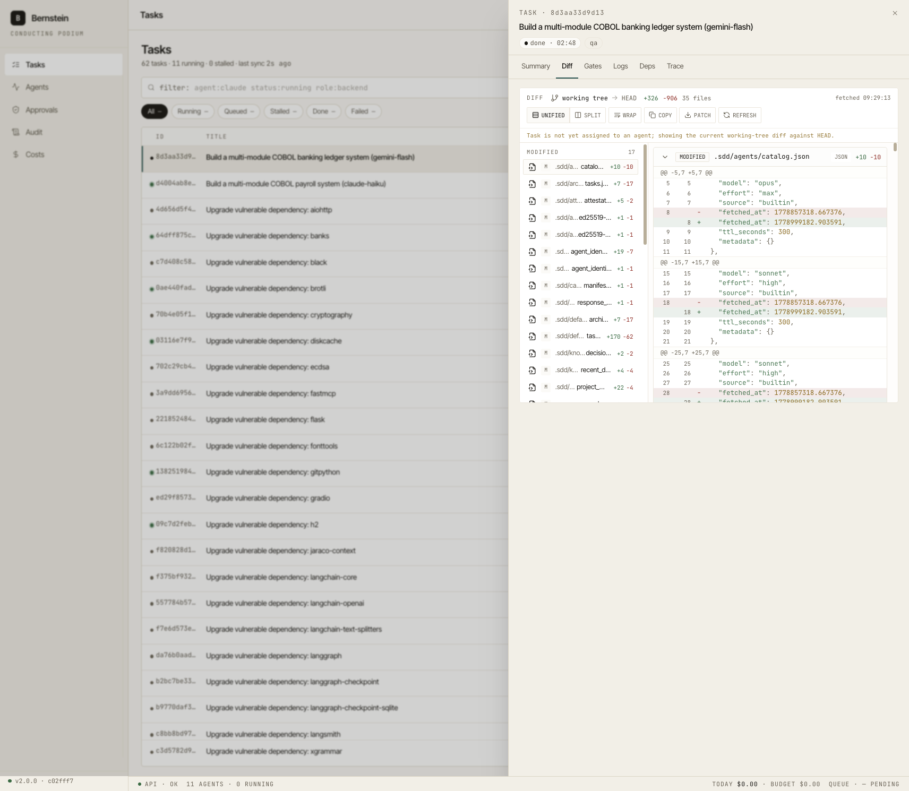
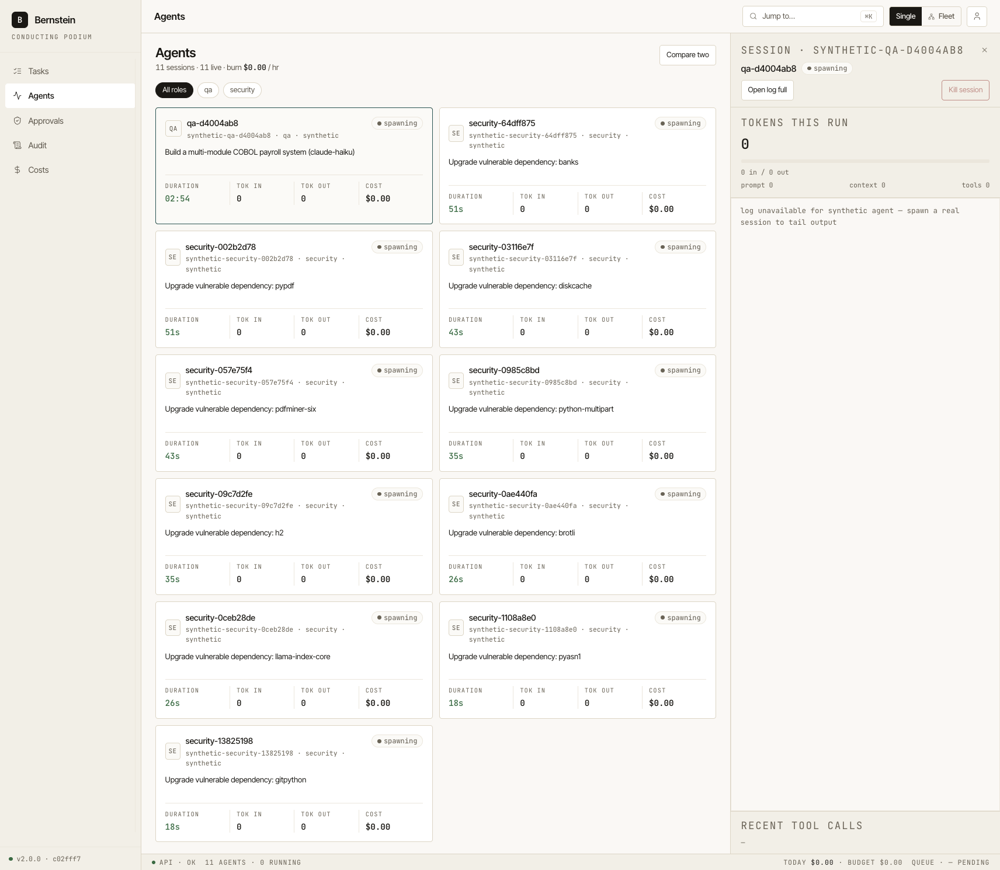

# Screens

Five routes. Source: `web/src/routes/`. Design reference: `.sdd/backlog/open/frontend/design_handoff_bernstein_phase1/README.md` §6.

## Screenshots

## Tasks (`/ui/tasks`, default route)

- **Source:** `web/src/routes/Tasks.tsx`.
- **Layout:** 2-column grid `1fr 380px`. Left = filter chips + table. Right = selected-task drawer.
- **Data shown:** task ID, title + branch, agent, role pill, duration (color-coded if stalled), progress bar, cost.
- **Filter chips:** All · Running · Queued · Stalled · Done · 24h · Failed (with counts).
- **Operator search syntax:** mono input parses `agent:` / `status:` / `role:` token prefixes.
- **Drawer tabs:** Summary · Diff · Gates · Logs · Deps · Trace.
- **Actions:** Cancel run · Re-run · Change model · Change role · Kill session.
- **Endpoints:** `GET /api/v1/tasks?status=&agent=&page=`, `POST /api/v1/tasks/{id}/{cancel,retry,prioritize,kill}`, `POST /api/v1/tasks/batch-ops`. SSE: `task_update`, `task_progress` over `/api/v1/events`.
- **Replaces TUI widget:** `task_list.py` + `task_detail_overlay.py` + `dependency_graph.py`.

## Agents (`/ui/agents`)

- **Source:** `web/src/routes/Agents.tsx`.
- **Layout:** 2-column grid `1fr 420px`. Left = 2-up card grid. Right = selected-agent drawer.
- **Card content:** mono 2-letter avatar, name, session id + role, status pill, current task, 4-metric strip (duration, tokens in, tokens out, cost).
- **Drawer:** stacked token meter (prompt / context / tools), live log with INFO / PLAN / PASS / WARN / WAIT / LIVE coloring, historical-vs-live separator rule.
- **Actions:** kill session, compare two agents (overlay with shared time axis).
- **Endpoints:** `GET /api/v1/agents`, `GET /api/v1/agents/comparison`, `POST /api/v1/agents/{session_id}/kill`. Live tail: `GET /api/v1/agents/{session_id}/stream` (SSE, ANSI-coloured).
- **Replaces TUI widget:** `agent_log.py` + `tokens.py` + `agent_duration.py` + `worker_badges.py`.

## Approvals (`/ui/approvals`)

- **Source:** `web/src/routes/Approvals.tsx`.
- **Layout:** 2-column grid `440px 1fr`. Left = queue. Right = selected approval (Why card · Diff · Action bar).
- **Queue row:** tool name (mono pill), role pill, target line (mono), agent + task footer, risk score chip (low / moderate / elevated / high), wait time.
- **Why? card:** shield icon + "N reasons · M mitigations". Bulleted reasons, color-dotted by severity.
- **Diff card:** sticky filename + +/− counts, mono 11.5 px, `+` lines green wash, `−` lines red wash, `max-height: 240px` with internal scroll.
- **Action bar:** primary "Approve once" + danger "Deny" + ghost "Always allow / Always deny" + kbd hints (`A` / `D`).
- **Endpoints:** `GET /api/v1/approvals/queue?session_id=`, `POST /api/v1/approvals/{approval_id}/resolve` with `{decision: allow|reject|always, reason}`. Updates from `/api/v1/events` increment the sidebar badge.
- **Replaces TUI widget:** `approval_panel.py`.

## Audit (`/ui/audit`)

- **Source:** `web/src/routes/Audit.tsx` (when present; otherwise scaffolded).
- **Layout:** single column, full-width.
- **Chain status banner:** 4-col card grid - chain status (verified), head (#ID + truncated hash), Sigstore anchor (rekor entry), rotated (age + chunk).
- **Filters bar:** search · actor · action · time, separated by hairline dividers, mono uppercase labels above each value, "Reset" ghost button on right.
- **Table:** Timestamp (ISO mono, color-coded operator vs system) · Actor · Action · Resource · Hash (mono truncated `…`) · Chain status icon (verified / rebuilt).
- **Verify chain modal:** triggered by primary "Verify chain". Shows last verified head, walked range, sigstore transparency anchor pointer, "Re-verify from chunk #" button.
- **Endpoints:** `GET /api/v1/audit?event_type=&search=&from=&to=&page=&page_size=` → `{items,total,page,page_size}`. Export: `POST /api/v1/audit/export?format=csv|jsonl`.
- **Replaces TUI widget:** none - audit chain inspection had no TUI surface.

## Costs (`/ui/costs`)

- **Source:** `web/src/routes/Costs.tsx` (when present; otherwise scaffolded).
- **Layout:** single column, fluid grid.
- **Top KPI row:** 4 cards (`1fr 1fr 1fr 1.4fr`) - today · 7 d · projected month · daily-budget gauge with 5 px progress bar.
- **24 h sparkline:** recharts `<BarChart>`, 8 px bars / 2 px gap, last bar full accent. Dashed gridlines at 25 / 50 / 75 %. Mono x-axis labels (`−24h / −18h / −12h / −6h / now`).
- **By-adapter table:** Adapter (mono) · Calls · Tokens · Cost · Share (progress + %) · Δ 7 d (mono colored: green if reduced, warning if > +20 %).
- **Top 10 tasks:** index column (mono `01`–`10`) · title + agent meta · cost (mono bold right).
- **Endpoints:** `GET /api/v1/costs/current`, `/costs/history`, `/costs/by-tag`, `/costs/forecast`. Live ticks: `GET /api/v1/events/cost`.
- **Replaces TUI widget:** `cost_sparkline.py`.
