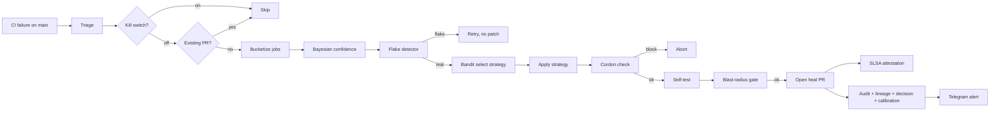

# Auto-heal v2

Self-healing CI on `main`. When a required check fails, the v2
workflow classifies the failure, picks a repair strategy via a
multi-arm bandit, applies it inside a cordoned worktree, opens a PR,
and lets standard branch protection decide.

## TL;DR

| Layer | What it does | Persisted state |
|-------|--------------|-----------------|
| Detection | Reads the failed run, buckets jobs, scores Bayesian confidence, judges flake-vs-real | `.sdd/autoheal-bayes.json` |
| Classification | Routes to safe / heuristic / risky / unknown | none |
| Repair | Thompson-samples a strategy, applies it, runs a diff-aware self-test | `.sdd/autoheal-bandit.json`, `.sdd/autoheal-shadow.json` |
| Safety | Cordon allowlist, blast-radius gate, cost circuit-breaker, kill switch | `.sdd/autoheal-disabled` |
| Provenance | Lineage v2 child body + decision-log entry + calibration row | `.sdd/autoheal-history.jsonl` |

All state files are gitignored. The workflow never commits state.

## Architecture



## The 26-capability matrix

`status` is one of: `shipped` (works in this PR), `partial` (module
shipped, workflow wiring deferred), `deferred` (planned for v3).

| # | Capability | Status | Bernstein hook |
|--:|-----------|--------|----------------|
| 1 | Bayesian per-class confidence | shipped | `core.autoheal.bayesian` |
| 2 | Flake vs real-fail distinguisher | shipped | `core.autoheal.flake_detector` |
| 3 | Diff-aware fail localisation | deferred | bisect helper to land in v3 |
| 4 | Failure clustering (bucketize) | shipped | `core.autoheal.categorizer.bucketize` |
| 5 | LLM-grounded categorisation | partial | cost-guard preflight in place; prompt path deferred |
| 6 | Sibling-bug hunt | deferred | needs blame oracle, planned v3 |
| 7 | Code-provenance check | shipped | `core.autoheal.provenance` |
| 8 | Multi-arm-bandit strategy select | shipped | `core.autoheal.bandit` |
| 9 | LLM-grounded fix synthesis | partial | cost-guard ready; prompt deferred |
| 10 | Counter-example test injection | deferred | planned v3 |
| 11 | Diff-aware self-test | partial | workflow runs ruff check / format / typos; blast-radius mapping deferred |
| 12 | Permission-profile enforcement | shipped | `core.autoheal.cordon` + cordon CLI |
| 13 | Cost circuit-breaker | shipped | `core.autoheal.cost_guard` |
| 14 | Adversarial pre-merge test | deferred | adversary role exists, wiring v3 |
| 15 | Blast-radius gate | partial | import-guarded in workflow; threshold tuning v3 |
| 16 | Lineage v2 attestation | shipped | `core.autoheal.lineage_writer` (extensible `meta` channel) |
| 17 | Decision-log entry | shipped | `core.autoheal.wire` writes `autoheal_strategy` rows |
| 18 | Calibration tracking | shipped | `core.autoheal.wire` writes predicted/observed pairs |
| 19 | SLSA build-provenance attestation | shipped | `actions/attest-build-provenance` |
| 20 | Structured Telegram alert | shipped | workflow step |
| 21 | Operator-readable audit ledger | shipped | `.sdd/autoheal-history.jsonl` |
| 22 | Shadow-mode quarantine + promote | shipped | `core.autoheal.shadow_mode` |
| 23 | One-button kill switch | shipped | `.sdd/autoheal-disabled` + `core.autoheal.kill_switch` |
| 24 | Idempotency (content hash dedupe) | shipped | `core.autoheal.idempotency` + branch name |
| 25 | Cordon-zone enforcement (pre-commit) | partial | CLI + module shipped; pre-commit hook deferred to v3 |
| 26 | Cost-aware degradation | shipped | `cost_guard.llm_globally_disabled` |

Shipped: 16. Partial: 5. Deferred: 5. Total surface: 26.

## Forward-compat env knobs

Operators can route observability sidecars to alternative storage
without forking this package:

| Env var | Purpose | Default |
|---------|---------|---------|
| `BERNSTEIN_AUTOHEAL_LOG_PATH` | Audit ledger destination | `.sdd/autoheal-history.jsonl` |
| `BERNSTEIN_AUTOHEAL_DECISION_LOG_PATH` | Decision-log destination | `.sdd/runtime/decisions.jsonl` |
| `BERNSTEIN_AUTOHEAL_CALIBRATION_LOG_PATH` | Calibration log destination | `.sdd/metrics/calibration.jsonl` |
| `BERNSTEIN_AUTOHEAL_CORDON_EXTRA` | Colon-separated extra exact-allow paths | (empty) |
| `BERNSTEIN_AUTOHEAL_BANDIT_SEED` | Integer seed for reproducible bandit picks | (fresh RNG) |
| `BERNSTEIN_AUTOHEAL_BUDGET_USD` | Daily LLM budget cap | `1.00` |
| `BERNSTEIN_AUTOHEAL_DISABLE_LLM` | Any non-empty value globally disables LLM paths | (unset) |

## State files

| Path | Purpose |
|------|---------|
| `.sdd/autoheal-disabled` | Kill switch flag |
| `.sdd/autoheal-bandit.json` | Bandit posteriors (alpha / beta per strategy) |
| `.sdd/autoheal-bayes.json` | Bayesian per-class confidence |
| `.sdd/autoheal-shadow.json` | Shadow-mode tally per strategy |
| `.sdd/autoheal-history.jsonl` | Operator-readable JSONL ledger |

## CLI surface (used by the workflow)

```
python scripts/auto_heal_v2_run.py triage
python scripts/auto_heal_v2_run.py check-kill-switch
python scripts/auto_heal_v2_run.py select-strategy --candidates a,b,c
python scripts/auto_heal_v2_run.py record-outcome \
    --strategy ruff-format --cls safe --job Lint --outcome success
python scripts/auto_heal_v2_run.py log < record.json
python scripts/auto_heal_v2_cordon.py <path> [--whitespace-only]
python scripts/auto_heal_v2_imports.py <alias>
```

## Operator workflow

### Disable for an incident

```
mkdir -p .sdd
echo "2026-05-20T12:00:00Z" > .sdd/autoheal-disabled   # disable until time
echo "forever" > .sdd/autoheal-disabled                # disable indefinitely
rm .sdd/autoheal-disabled                              # re-enable
```

### Read the audit ledger

```
jq -r '"\(.ts | localtime) \(.outcome) \(.strategy) \(.cls) \(.rationale)"' \
    .sdd/autoheal-history.jsonl
```

### Emergency revert

The frozen v1 workflow lives at `.github/workflows/auto-heal-v1.yml`
with all jobs gated by `if: false`. To revert, swap the v2 file out of
the workflows directory and re-enable v1 by replacing the static
`false` gates with the original guards from git history.

## v1 vs v2

| Aspect | v1 | v2 |
|--------|----|----|
| Workflow file | `auto-heal.yml` (kept frozen as `auto-heal-v1.yml`) | `auto-heal.yml` |
| Repair strategies | 4 hardcoded recipes | bandit-selected from a growing set |
| Confidence | Flat safe/heuristic/risky | Numeric Bayesian per-class |
| Flake handling | None | non-adjacent-failure heuristic |
| State | `.sdd/` not used | `.sdd/autoheal-*.json{,l}` |
| Cordon | YAML regex | Python module (also pre-commit) |
| Cost guard | None | `cost_guard` with budget cap |
| LLM path | None | Optional, behind cost-guard |
| Lineage | None | Lineage v2 child body |
| Decision log | None | Per-action entry |
| Calibration | None | Per-action probability log |
| Tests | 152 unit + integration | 178 unit + 15 property + 11 integration |
